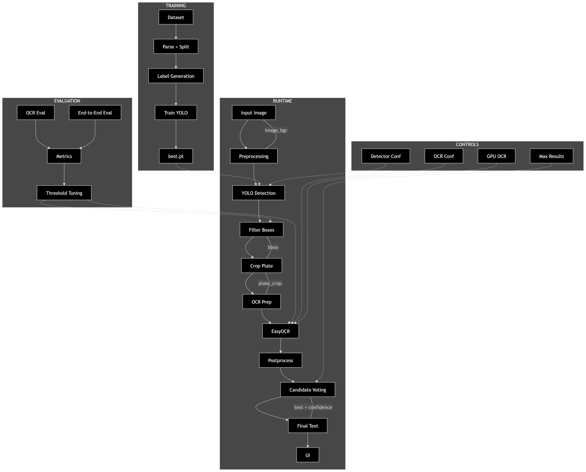

# ANPR From Scratch (Detector + OCR + UI)

This implementation gives you a complete ANPR pipeline in your current workspace:

- Dataset parser for your XML + image format
- YOLOv8 number plate detector training
- OCR inference using EasyOCR
- End-to-end Streamlit UI
- Accuracy evaluation scripts

## Architecture Diagram



The architecture follows three connected flows:
- Data preparation: XML parsing, split generation, YOLO label creation, and OCR crop export.
- Training and validation: YOLOv8 detector training, evaluation, and threshold calibration.
- Runtime inference: detection -> plate crop -> OCR -> postprocessing -> ranked predictions in the Streamlit UI.

For a full technical breakdown, see `project-guide.md`.

## 1) Install

```powershell
python -m pip install -r requirements.txt
```

## 2) Prepare Dataset

```powershell
python scripts/prepare_dataset.py
```

Outputs:
- `data/processed/labels.csv` (OCR labels)
- `data/processed/plates/*.jpg` (cropped plates)
- `data/yolo/yolo.yaml` (detector config)

## 3) Train Detector

```powershell
python scripts/train_detector.py --epochs 100 --imgsz 1280 --batch 8 --device 0 --model-size s --patience 30
```

Best model is copied to:
- `artifacts/detector/best.pt`

If no GPU, use:

```powershell
python scripts/train_detector.py --epochs 100 --imgsz 1280 --batch 4 --device cpu --model-size s --patience 30
```

## 4) Evaluate Accuracy

OCR only (using ground-truth crops):

```powershell
python scripts/evaluate.py --mode ocr-only
```

End-to-end (detector + OCR):

```powershell
python scripts/evaluate.py --mode end2end
```

End-to-end with tuned thresholds:

```powershell
python scripts/evaluate.py --mode end2end --detector-conf 0.30 --ocr-min-conf 0.25
```

Auto-calibrate thresholds on validation samples:

```powershell
python scripts/calibrate_thresholds.py --limit 200
```

## 5) Run UI

```powershell
streamlit run app.py
```

Upload an image and view:
- Detected plate boxes
- OCR text
- Confidence scores
- Optional similarity vs ground truth text

## Notes To Reach 80-90%

- Use at least `60-120` detector epochs.
- Keep image size high (`imgsz 960` or `1280`) for small plates.
- Prefer `model-size s` or `m` over `n` for better mAP if GPU allows.
- Keep early stopping patience around `25-40` to avoid undertraining.
- Expand dataset with more OCR-labeled XML/images.
- Clean plate text labels (remove inconsistent characters).
- Evaluate frequently and tune confidence threshold in UI.
- Use threshold calibration script after each major retrain.
